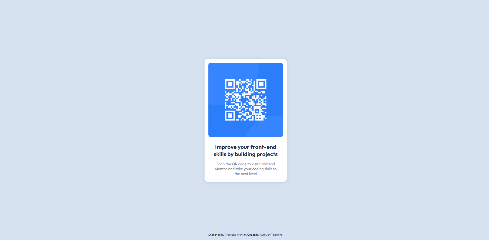

  

  <h1 align="center">QR Code Component Solution</h1>
  

    <a href="https://www.frontendmentor.io/challenges/qr-code-component-iux_sIO_H" target="_blank"><strong>Frontend Mentor Challenge</strong></a>

 
 

## **Preview**

 

## **Links**

- Solution URL: 
- Live Site URL:https://ruthjoy76.github.io/qr-code-challenge/ 
 

## **Built With**

- HTML5  
- CSS3 
 

## **Tools Used**

- Google     
- Visual Studio Code
 

## **Outcome**

* Used HTML5 <em>**semantic elements**</em> only. 
* Used CSS3's <em>**flex and grid**</em> for container layout.
* Used <em>**Git** </em> and <em> **GitHub**</em>  for project management
* Maintain <em>**clean code**</em>
* I applied all the lesson that I've learned in KodeGo.

 

## **What I learned**
* Flexbox and grid
* pseudo class (:root)
* Semantic elements
  
 

## **Acknowledgment**

* Inspiration by [Frontend Mentor](https://www.frontendmentor.io)

 

